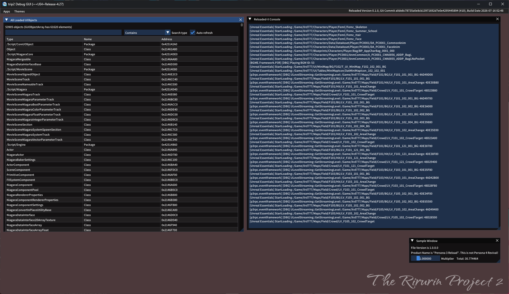
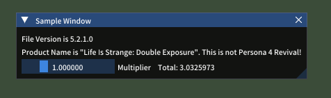
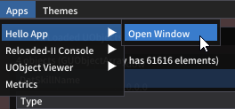
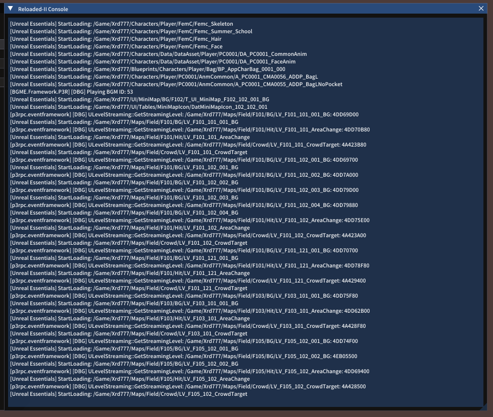
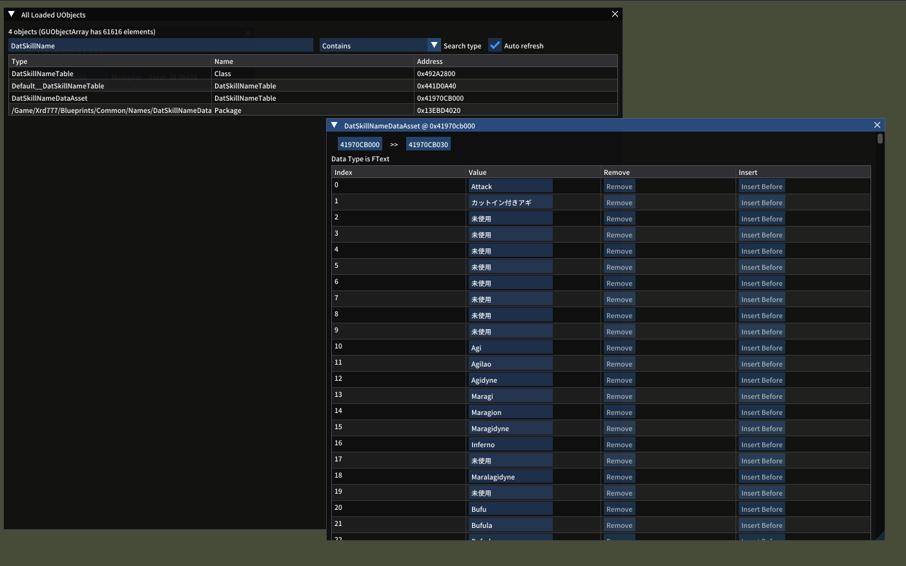
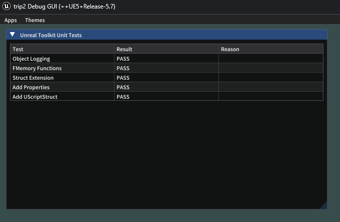

# p4rpc.trip2.debugui



A library for [Reloaded-II](https://github.com/Reloaded-Project/Reloaded-II) which provides a debug window that mods can interface with to construct custom UI using [ImGui](https://github.com/ocornut/imgui/). This is intended for mod developers who want to create UI to test parts of their mod but don't want to write on top of the game window using a hook.

This library currently only works with Unreal Engine 4/5 since it was designed as a dependency for a mod I'm working on for Persona 4 Revival. However, there is nothing significant preventing this from being used in other game engines as long as you hook onto your engine's main event loop, and backends for other engines may be made in the future.

## Installation

Drag the 7z file for the app you want to use into the Reloaded mod. This should auto-download all the dependencies needed as well.

## Features

- Run multiple UI apps in a cooperative multitasking environment
- Apps can construct windows and create action buttons accessible from the "Apps" tab through the `IGUIApp` interface
- Use any theme from [ImThemes](https://github.com/Patitotective/ImThemes/) to customize the UI

## Included Apps

### Hello World



A sample app provided to demonstrate the features of the library. This creates one window that opens on startup and registers a "Open Window" button in the Apps menu:



For users familiar with modding using UE4SS, this is equivalent to the buttons feature.

### Reloaded Console



Displays the output of the Reloaded-II console in a window.

### UObject Viewer



Provides an interface to view and edit properties of any UObject in the currently running game.

### UE Toolkit Tests



Used for unit testing of [UE Toolkit](https://github.com/RyoTune/UE.Toolkit) in a live environment.

## Creating a Debug App (C#)

Create a new Reloaded-II mod from the "Reloaded II Mod Template" ([more info here](https://reloaded-project.github.io/Reloaded-II/DevelopmentEnvironmentSetup/)). In your .csproj, make sure that the target framework is set to `net9.0` since the dependencies your mod will need require at least that version (as of writing, Reloaded does not support .NET 10 or later).

From NuGet, download `p4rpc.trip2.debugui.Interfaces` and `p4rpc.trip2.ImGui`. In the reference to `p4rpc.trip2.ImGui`, add an imgui alias (it won't be able to find the ImGui class in the package's namespace if you don't do this):

```xml
<ItemGroup>
    <PackageReference Include="p4rpc.trip2.ImGui" Version="1.91.3" Aliases="imgui" />
    <!-- Other Packages -->
</ItemGroup>
```

In your mod's constructor in `Mod.cs`, retrieve the controller for `IGUIState` and store it somewhere:

```c#
// ...

public class Mod : ModBase 
{
    // ...
    private readonly IModConfig _modConfig;
    private IGUIState _guiState;
    private App _app;

    public Mod(ModContext context)
    {
        // ...
        _modLoader.GetController<IGUIState>().TryGetTarget(out _guiState);
        _app = new(_guiState);
        _guiState.Register(_app);
    }
}

// ...

```

The `App` object will be your debug program. Create a class for this somewhere that implements `GUIApp`:

```c#
public class App : GUIApp 
{
    // This is the name that will appear in the Apps menu
    public override string Name => "Name of your App";

    public override void Tick(float DeltaTime)
    {
        // ...
    }

    public App(IGUIState state) : base(state)
    {
        // ...
    }
}
```

Buttons can be added by adding a callback with no parameters or return value into the `Buttons` property:

```c#
public App(IGUIState state) : base(state)
{
    var OpenWindow = () =>
    {
        // If we only want one instance of this window open at once
        if (Windows.Count == 0)
            Windows.Add(new SampleWindow(this));
    };
    // If you want the window to open on startup, you can call the callback in the app's constructor
    OpenWindow();
    Buttons.Add("Open Window", OpenWindow);
}
```

Creating windows involves defining a window class that implements from `GUIWindow` with the type of your app as a generic parameter:

```c#
public class SampleWindow(App owner) : GUIWindow<App>(owner)
{
    public override string Title => "Sample Window";
    
    public override void Draw(App owner)
    {
        // ...
    }
}
```

To use the alias that we set earlier to call methods from the ImGui class, define the external alias at the top of the file:

```c#
extern alias imgui;
using imgui::p4rpc.trip2.ImGui;
using ImGui = imgui::p4rpc.trip2.ImGui.ImGui;
```

Then you can call ImGui methods by just prefixing it with `ImGui`:

```c#
public override void Draw(App owner)
{
    ImGui.Text($"Test text!");
    ImGui.SliderFloat("Slider Value", ref owner.SliderValue, 0, 100, "%f", 0);
}
```

If you're working on a larger app, I would recommend reading the [performance recommendations](https://github.com/Sewer56/DearImguiSharp#performance-recommendations) from DearImguiSharp for some tips on how to optimize your app.

## Creating a Debug App (Blueprints)

Coming soon!

## Dependencies
- [riri.modruntime](https://github.com/rirurin/riri-mod-tools) to provide an executable hash
- [riri-imgui-vulkano](https://github.com/rirurin/riri-imgui-vulkano) to handle rendering ImGui using Vulkan and manages window events
- [cimgui](https://github.com/rirurin/cimgui/tree/trip2) to provide a C FFI to use ImGui
- [DearImguiSharp](https://github.com/Sewer56/DearImguiSharp) which was used to generate C# bindings from cimgui
- [ImThemes](https://github.com/Patitotective/ImThemes) for it's collection of themes